# Hytte — example recipes

Twelve curated Norwegian classics ship inside the app (`src/data/norwegian-recipes.ts`). The screenshots below are the actual recipe detail modal as rendered in the running app. Image placeholders are blank because the sandbox blocks outbound Wikimedia traffic — on a normal network each modal loads its dish photo at the top.

The app also fetches international recipes from [TheMealDB](https://www.themealdb.com/) on demand via the **Hent flere** button in the Oppskrifter tab, but the local set below is enough to plan every dinner on its own.

---

## 1. Fårikål — Norges nasjonalrett
*Mutton & cabbage stew · 2 h · serves 4 · weekend*

The national dish of Norway. Layers of bone-in lamb and cabbage, whole peppercorns, simmered for two hours. Eaten on the last Thursday of September (Fårikålens festdag).

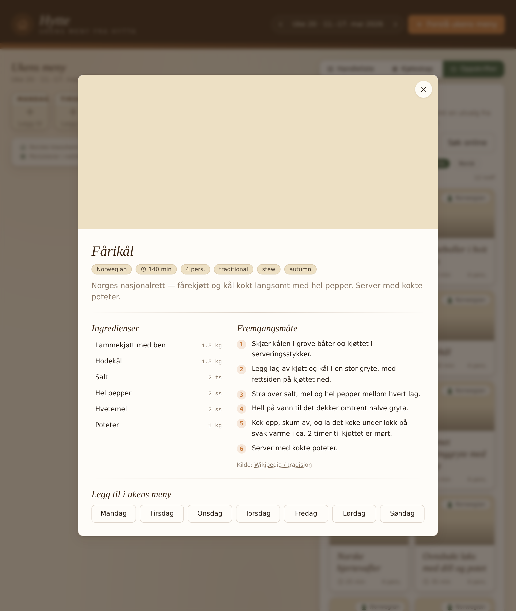

---

## 2. Kjøttkaker i brun saus — meatballs in brown sauce
*55 min · serves 4 · weekday · comfort*

Big juicy beef patties, browned in butter, finished in a creamy brown gravy made from oxtail stock. Served with boiled potatoes, peas, and lingonberry jam.

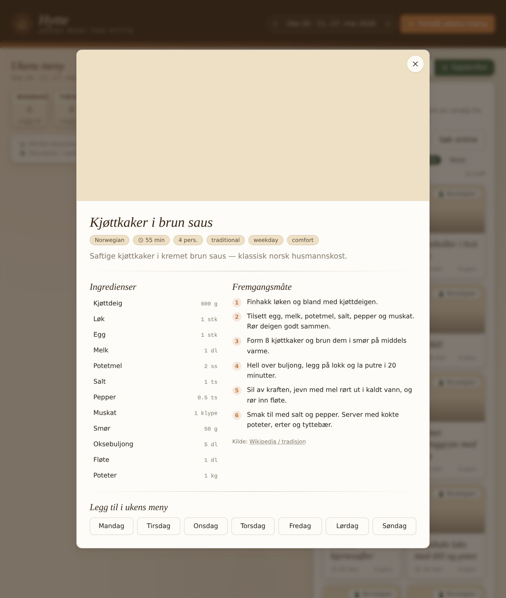

---

## 3. Brun lapskaus — beef & root-vegetable stew
*110 min · serves 4 · weekday · stew*

The dish that fills the cabin on a cold day. Chuck beef, potatoes, carrots, swede, onion, slow-simmered until you can break it apart with a spoon.

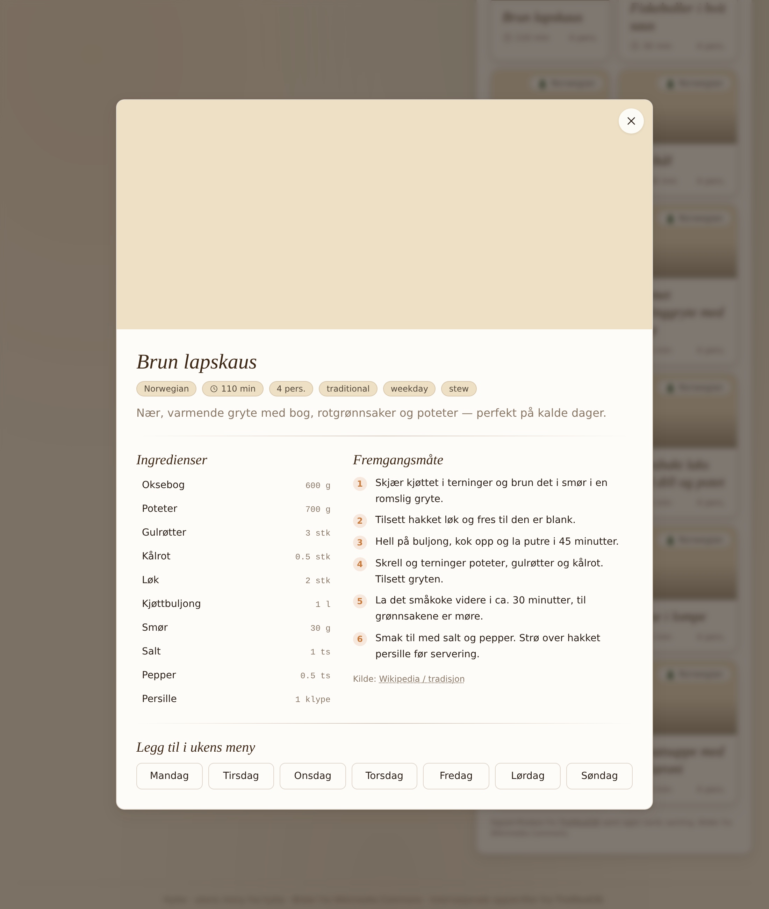

---

## 4. Raspeballer (komle) — west-coast potato dumplings
*90 min · serves 4 · Thursday tradition*

Raw and boiled potato grated and pressed into dense dumplings, simmered in salted-lamb broth. Served with the lamb, swede mash, and melted butter. Vestlandet's classic Thursday dinner.

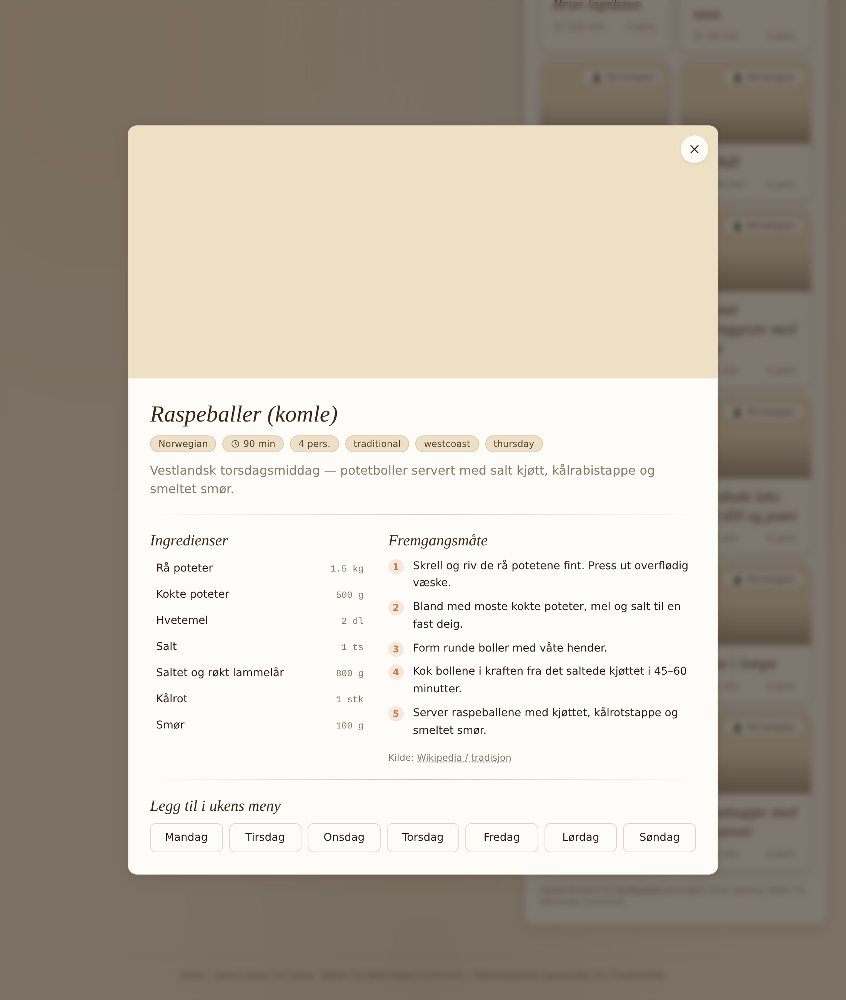

---

## 5. Fiskeboller i hvit saus — fish balls in white sauce
*30 min · serves 4 · quick · weekday*

The fastest fish dinner in the book — canned fish balls in a butter-flour-milk béchamel, finished with curry powder. Boiled potatoes and carrots on the side.

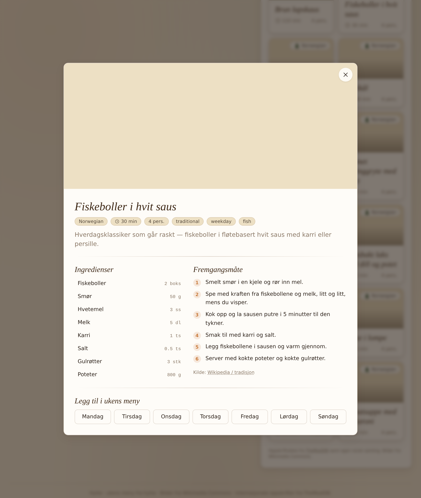

---

## 6. Fiskegrateng — fish gratin
*55 min · serves 4 · oven · comfort*

Cod or coley layered with macaroni, a buttery white sauce folded with whipped egg whites, topped with grated cheese, baked golden. A kindergarten lunch and a kitchen-table dinner in one.

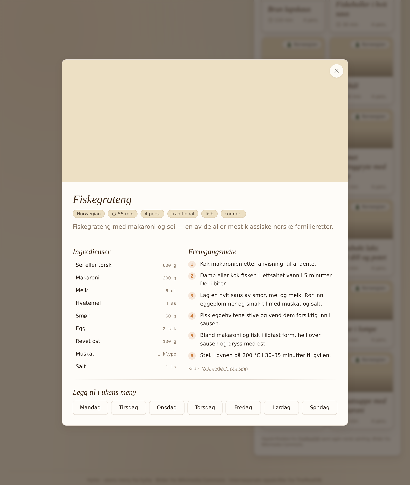

---

## 7. Plukkfisk — flaked fish with potato
*35 min · serves 4 · weekday · fish*

Salted cod or fresh cod flaked into mashed almond potatoes, served with melted butter and crisp bacon. Coastal comfort food.

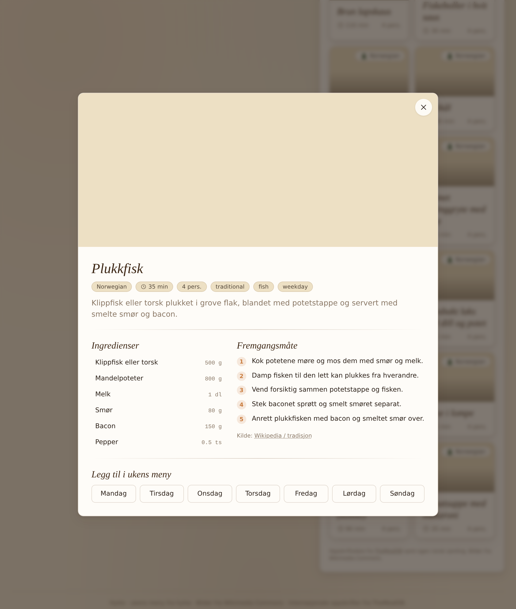

---

## 8. Ovnsbakt laks med dill og potet — oven-baked salmon
*35 min · serves 4 · healthy · oven*

Salmon fillet with lemon slices and fresh dill, roasted at 180 °C. Served with boiled almond potatoes and a garlic-dill sour cream dressing.

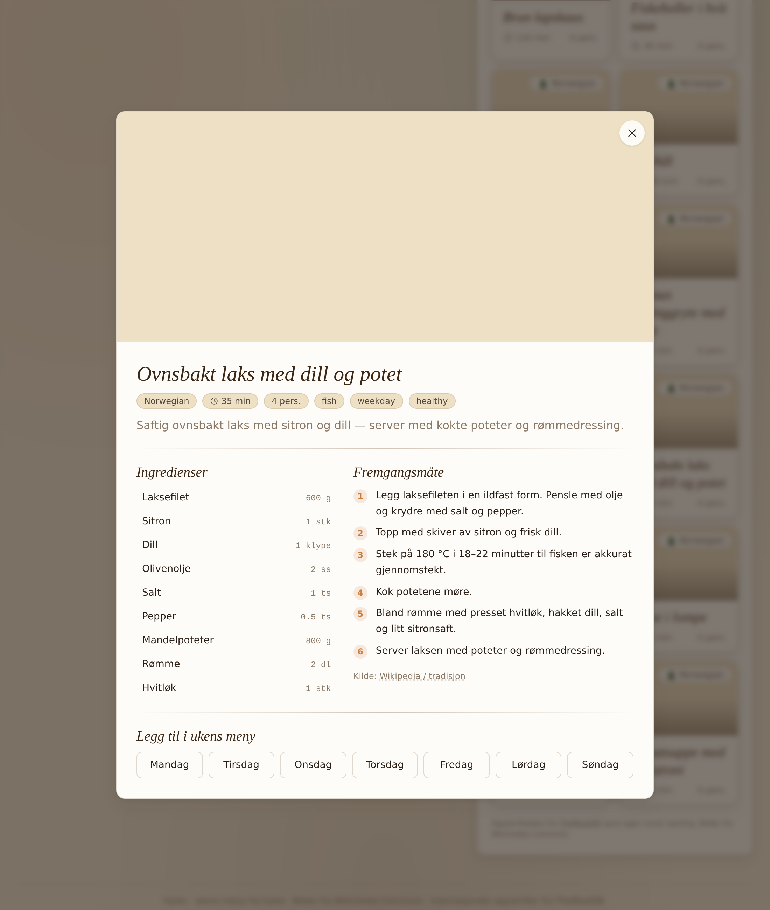

---

## 9. Kremet kyllinggryte med sopp — creamy chicken & mushroom stew
*35 min · serves 4 · weekday · creamy*

Chicken thigh and button mushrooms simmered in matfløte with thyme and chicken stock, served over rice. A reliable weeknight.

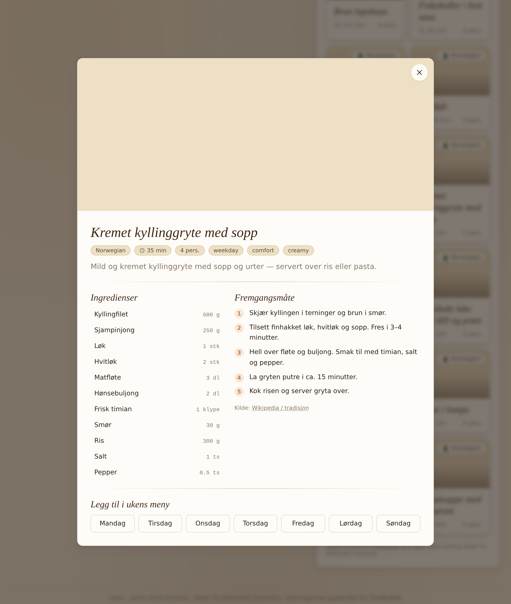

---

## 10. Tomatsuppe med makaroni — tomato soup with macaroni
*20 min · serves 4 · quick · kids*

Canned tomatoes, garlic, onion, stock, blended smooth, finished with cooked macaroni. The taste of Norwegian school lunches. Best with rugbrød and prim on the side.

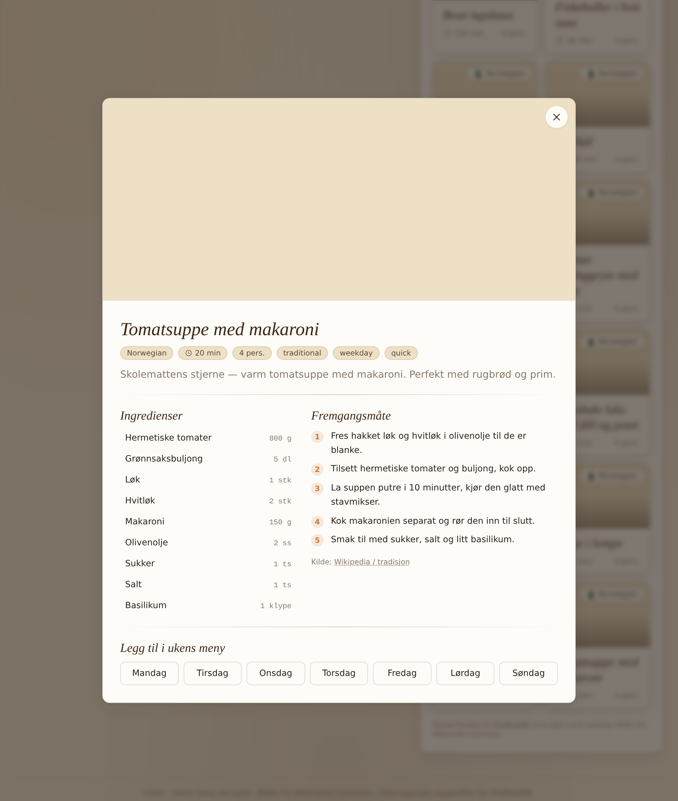

---

## 11. Pølse i lompe — sausage in a potato wrap
*15 min · serves 4 · 17. mai · street food*

Wienerpølse rolled in a thin potato flatbread (lompe) with mustard, ketchup, and fried-onion crumbs. The kveldsmat hero and the national-day staple.

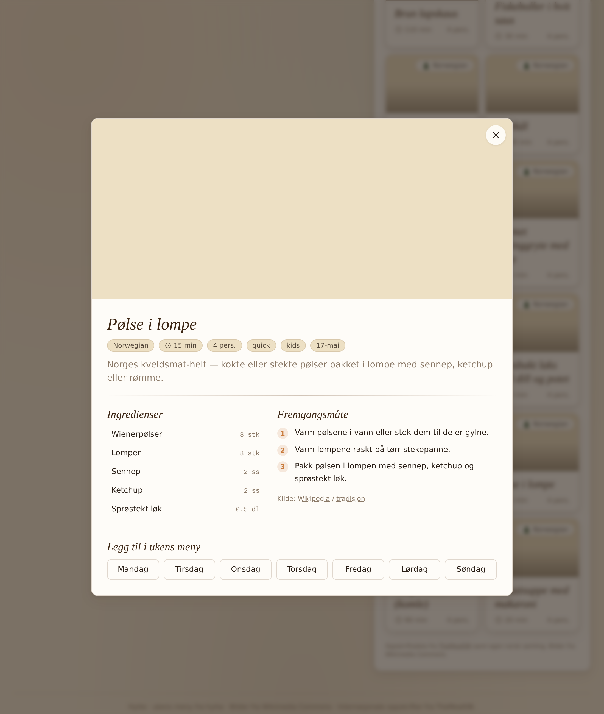

---

## 12. Norske hjertevafler — Norwegian heart waffles
*25 min · serves 4 · baking · hytte*

Thin, soft, heart-shaped waffles from a sweet batter (cardamom optional). Served with strawberry jam, sour cream, or brown cheese. The thing you bake the moment you arrive at the cabin.

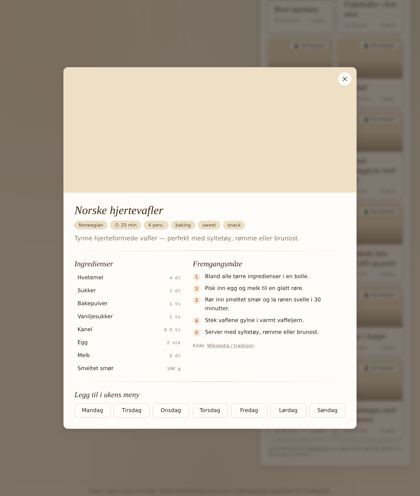

---

## How the planner uses these

- The fridge picker stores ingredient names like `potet`, `lok`, `smor`.
- When you hit **+ Forslå ukens meny**, the suggestion engine scores every recipe by how many ingredients are in the fridge, plus cuisine variety, plus a "no two stews in a row" rule.
- Picking a recipe stamps it on a weekday; the grocery list immediately diffs (recipes − fridge) and groups what's left by supermarket section.
- TheMealDB's `random.php` endpoint is wired into the **Hent flere** button to keep the pool fresh week-over-week.
