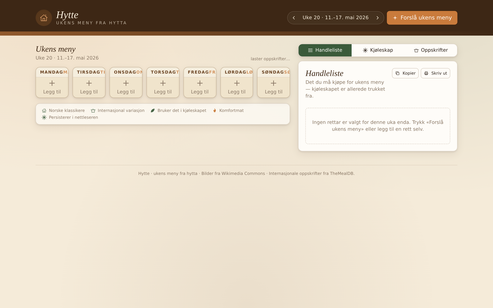
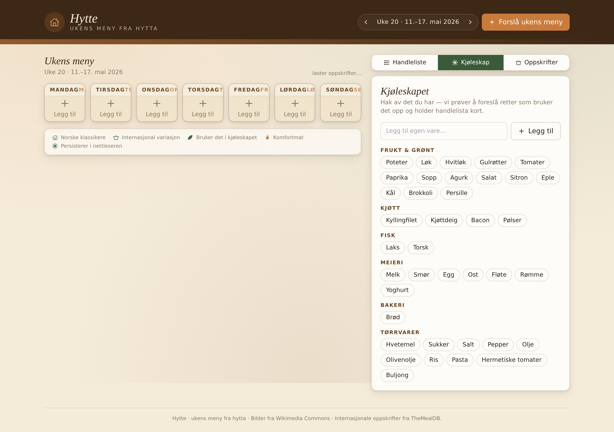
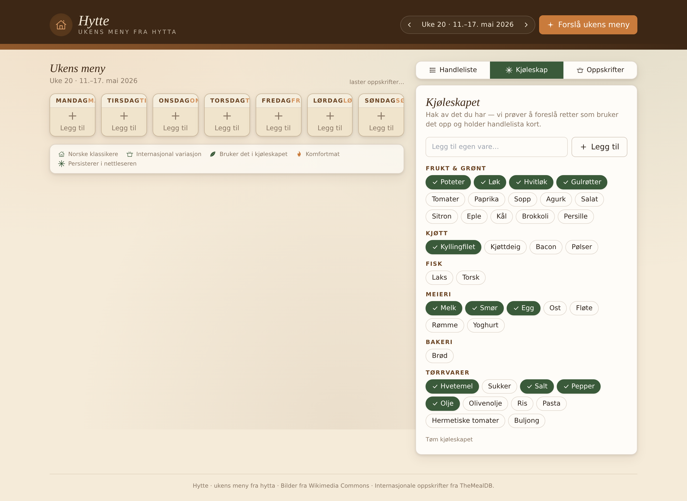
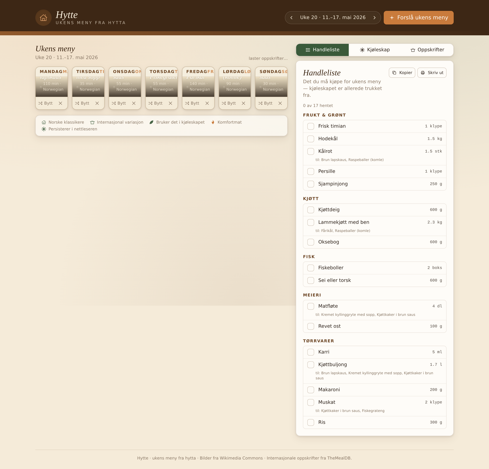
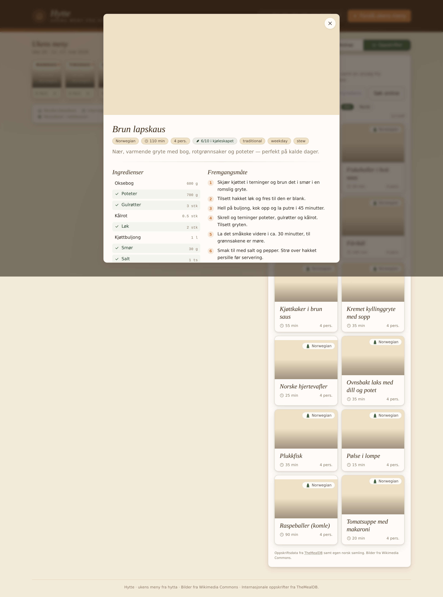
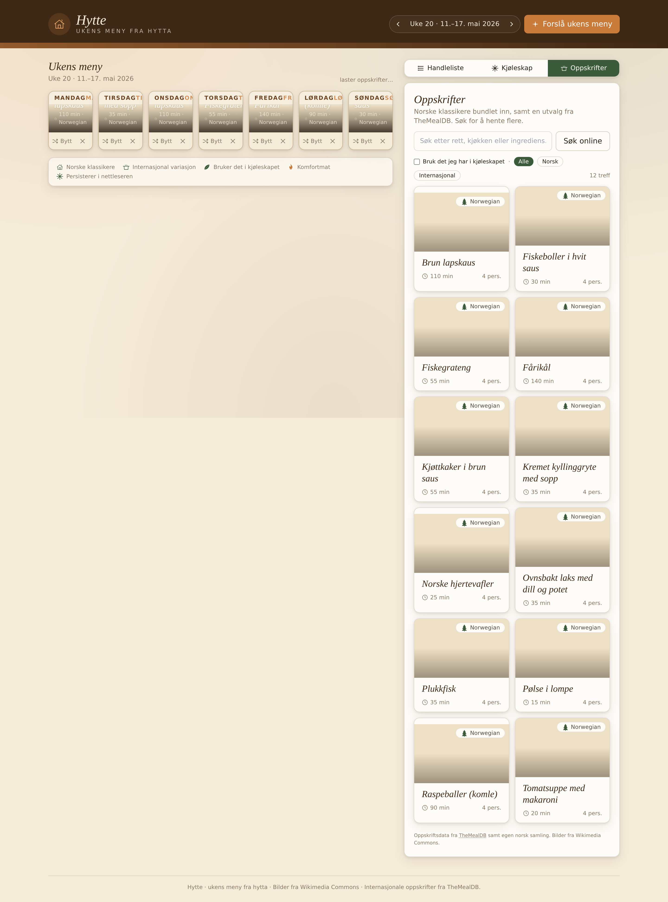
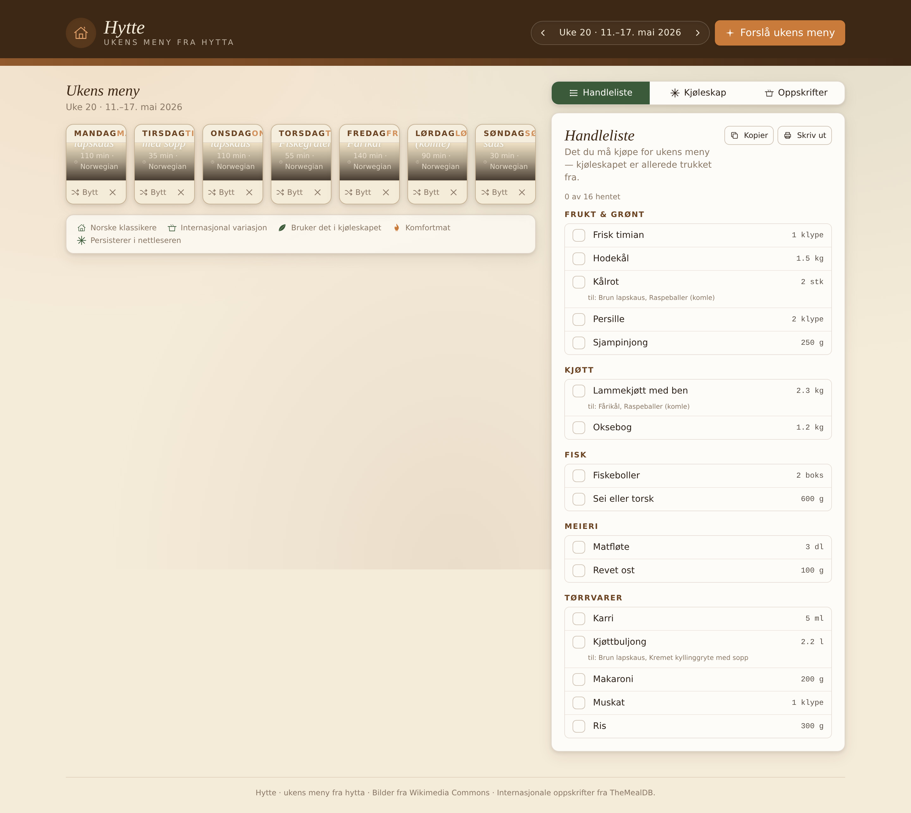
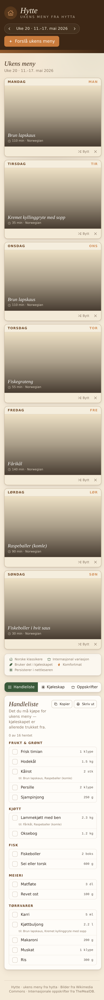

# Hytte — full UI walkthrough

A guided tour of the weekly meal planner. All shots are taken from a fresh browser session (empty localStorage) on the production build (`npm run build && npm run preview`).

The app is fully client-side: state lives in localStorage, curated Norwegian recipes ship in the bundle, and TheMealDB is fetched on-demand for international variety.

---

## 1. Empty state — Monday morning, nothing planned

The week opens to **Handleliste** (the grocery list tab) so you immediately see whether there's anything to buy. With no recipes assigned, every day says **Legg til** and the list is empty.



The brown header bar with the cabin glyph and the *Hytte — ukens meny fra hytta* tagline anchors the hytte cozy theme: warm cream backgrounds, pine green accents, ember orange action button.

---

## 2. Kjøleskap tab — empty fridge

Switching to **Kjøleskap** shows the ingredient picker grouped by category (Frukt & grønt, Kjøtt, Fisk, Meieri, Bakeri, Tørrvarer). Each item is a toggle pill.



There's also a free-text "Legg til egen vare" input that canonicalises arbitrary ingredient names.

---

## 3. Fridge filled — what we have at the hytte

I've toggled on a reasonable Norwegian weeknight pantry: potatoes, onion, garlic, carrots, chicken fillet, milk, butter, eggs, flour, salt, pepper, oil. Selected items turn pine green with a checkmark.



This is the seed for the suggestion engine — it scores recipes by how many ingredients you already have.

---

## 4. Forslå ukens meny — one click, seven dinners

Hitting the ember **+ Forslå ukens meny** button in the header fills all seven days. The planner picks a mix of Norwegian classics and international variety, biased toward recipes that use what's in the fridge and avoid repeats.


Each day card shows the recipe title, source tag, time, and a **Bytt** button to swap just that day (rerolls one slot without disturbing the others). The grocery list on the right immediately reflects the plan — categorised, deduped across recipes, with fridge items already subtracted.

---

## 5. Handleliste — categorised, fridge-aware

Same view, scrolled view of the grocery panel. Items are grouped under **Frukt & grønt / Kjøtt / Fisk / Meieri / Tørrvarer** (Norwegian supermarket sections). Quantities are summed across recipes and presented in the most compact unit. **Kopier** and **Skriv ut** in the header export the list.



Checking off a row crosses it out, persists per-week in localStorage, and survives navigation.

---

## 6. Oppskrifter — the recipe browser

The third tab is the full recipe library: every curated Norwegian recipe plus anything fetched from TheMealDB. Each card shows time, servings, the cuisine, and a *N/M i kjøleskapet* badge when fridge ingredients match.


Tomatsuppe med makaroni, Raspeballer (komle), Plukkfisk, Pølse i lompe, Norske hjertevafler, Ovnsbakt laks med dill og potet, Kremet kyllinggryte med sopp, Kjøttkaker i brun saus — the heart of the curated set.

---

## 7. Recipe detail — Brun lapskaus

Clicking any card opens a full-screen reader: ingredients column (with the ones you have in green), numbered method, source link to Wikipedia or TheMealDB, and a day-picker row to drop it onto the plan.



The pine-green chip *6/10 i kjøleskapet* is the headline match score — six of ten ingredients are already in the fridge, so this is a low-shopping-list dinner.

---

## 8. Assign to a day — Onsdag

Picking **Onsdag** from the weekday row at the bottom of the modal stamps the recipe onto Wednesday. The grocery list updates instantly to subtract the fridge overlap and add the rest.



---

## 9. Back to the grocery list — updated plan

After closing the modal and returning to **Handleliste**, the list reflects the current 7-day plan, dropping items the fridge already covers.



---

## 10. Mobile layout

The grid collapses cleanly on a 390-wide viewport: header stacks, week becomes a vertical list, grocery list sits below.



---

## How to run it locally

```bash
cd hytte
npm install
npm run dev       # http://localhost:5173
# or
npm run build && npm run preview
```

All recipe data is bundled; the only outbound call is to `themealdb.com/api/json/v1/1/random.php` when you ask for variety via the *Hent flere* button in the Oppskrifter tab. If you're offline, the curated Norwegian set is enough to plan a full week.
